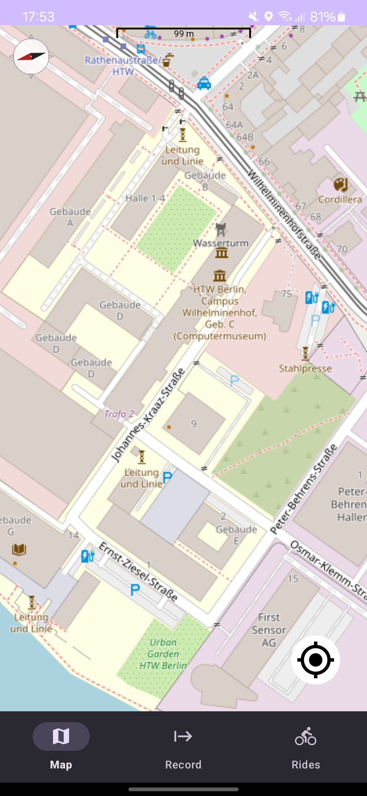
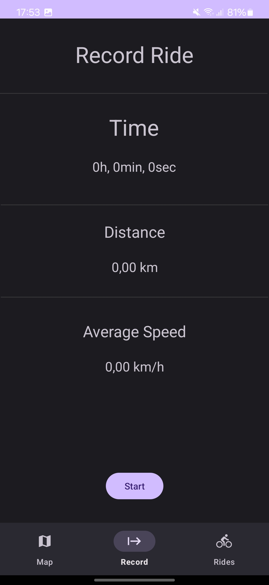
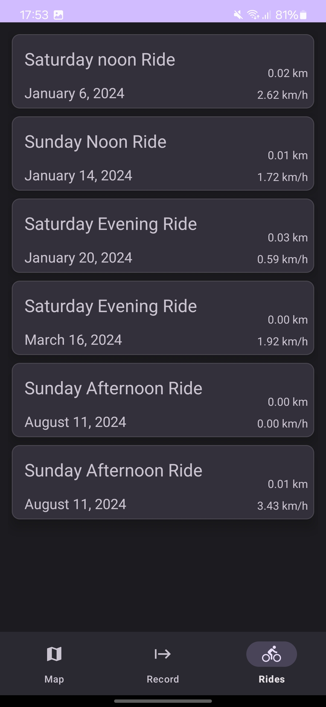

This an Android Ride Tracker App to record Distance based Workouts using GPS.
It also uses OSMDroid as a Map Service.

Thoroughly tested with unit and integration Tests using Mockito and Espresso. 
Build with the MVVM Pattern and the Rooms Database API.

## UI Screenshots

